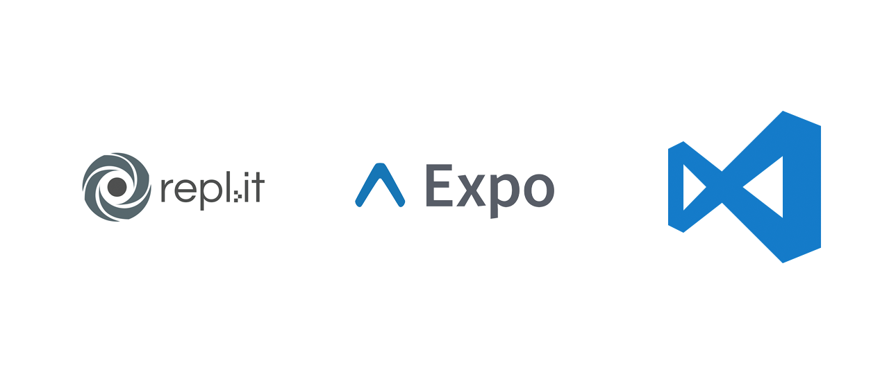

<style>
pre code {
    padding: 1em !important;
}
</style>


### React Native Fundamentals

- Cameron Wilby (@cameronwilby)

---

# Goals of this talk

- Learn about React Native
- See it in Action
- You build an app

----

## React: A Readers Digest
```js
const Button = props => (<button>{props.title}</button>);

class HomeScreen extends React.Component {
    render() {
        return (
            <div>
                <Button title="Hello" />
                <Button title="Geek" />
                <Button title="Girl!" />
            </div>
        );
    }
}

ReactDOM.render(<HomeScreen />, mountNode)
```

Note: 

- This talk will assume a little bit of knowledge of React

- Component-based
    - Build components in isolation (can be as small as a button or a list of some sort.)
    - Compose components together to form screens.
    - Compose screens together to form an app.
    - Think of your apps as kind of a tree structure.

- Plug Leslie's talk: "React: Up and Running" - same concepts 

----

## Mobile Web Apps


Note:
- Talk about mobile web apps
    - Written in HTML/CSS/JavaScript.
    - Capable of accessing Native APIs such as the Camera API, the accelerometer, etc.

- Tell them about the benefits
    - Clears a path to mobile development for web developers
    - Cross Platform / Single Codebase
    - Growing popularity, growing community and support

- What are the downsides?
    - "Not a truly native experience"
    - Performance issues
    - Reduced functionality (not all native apis are available)
    - Wouldn't build a game as a mobile web app.

----

## Mobile Web Apps


Note:
How does cordova work?
- Your app is running as JavaScript inside a WebView of an app.
- WebView is basically a headless web browser.
- Design the app using CSS to make things _look_ mobile
- Access native features such as the camera through a bridge.
- Most popular fork of Cordova was Ionic - which used AngularJS as a framework.

Downsides
- All UI rendering was controlled by a single JavaScript thread that can easily get overloaded.
- Looked like an app.. didn't feel like an app.
- Issues with the user experience.
- Tradeoff between performance and development efforts.

----

## Mobile Web Apps


Note:
How does react native work?
- Takes your React code and creates an Android and iOS project out of it.
- An android/ios app with real, native components.
- Not a browser. Actually, no HTML or CSS to be found anywhere.
- Use real, native components (sliders, images, date pickers)
- Lay them out using React and JSX.
- The bridge is still present.

----

## Supporting Tool: Expo

- Expo: Suite of tools to streamline RN development

Note:
What is Expo?
- A suite of tools to streamline react native development.
- It's a jack of all trades
- It is a library of components that interact with native features of the device
- It is a tool used to test react native apps on a physical device using only qr codes to deploy.
- It is a framework for the entire project lifecycle of a react native project.
- It is awesome.
- Downside: Expo is a red/blue pill situation. You can choose "ignorance is bliss" and just write JavaScript, or you can see how far the rabbit hole goes by ejecting the app to directly edit the resulting iOS/Android codebases.

----

## Getting Started



Note:
- I'm going to cover my suggested learning path for how to build mobile apps in React Native.

1. I recommend working on the React-Native exercises on Repl.it in an online environment. (Less yak shaving, more react native)
2. Next, get familiar with snack.expo.io, and build really small apps that do something very specific with expo, such as scanning barcodes or getting a square to move around based on the accelerometer.
3. Finally, get familiar with the development environment once you're ready to build an app for real.

----

- https://rebrand.ly/react-native-class

<!--<iframe src="https://repl.it/community/classrooms/17650" style="background-color: white;" width="1280" height="600" />-->

Note:
- Repl.it has provided a free set of exercises specifically tailored toward react native
- They're a great introduction to the framework

----

- https://snack.expo.io

<!--<iframe src="https://snack.expo.io/" width="1280" height="600" />-->

Note:
- This is the expo "snack" environment. 
- It's a very basic editor with a QR code to a great way to get your hands dirty, and removes a lot of distractions 
- (Change some code to show the code updating)
- In "the real world", this is mostly used for code demos and sharing examples with other developers in a clean environment.

----

## Development Environment

- Download and install [NodeJS](https://nodejs.org/) and [Visual Studio Code](https://code.visualstudio.com/).

- Install "Create-React-Native-App" - a CLI tool full of awesome

----

## C.R.N.A

> Create React Native Apps with no Build Configuration

```sh
$ npm install -g create-react-native-app

$ create-react-native-app my-app

$ cd my-app

$ yarn run start
```


Note: 
Which means less time worrying about boring boilerplate code, and more time building cool stuff.
----

## Demo

----

## Recommended Reading

https://rebrand.ly/cw-react-native

- **Routing**: [react-navigation](https://reactnavigation.org)
- **State**: [redux](https://github.com/reactjs/redux) & [react-redux](https://github.com/reactjs/react-redux)
- **UI Components**: [nativebase](https://nativebase.io)
- **Project Lifecycle**: [expo docs](https://docs.expo.io/versions/v17.0.0/introduction/project-lifecycle.html)

----

## Thanks for listening!

**Slides**: https://rebrand.ly/cw-react-native<br />
**Replit**: https://rebrand.ly/react-native-class<br />

<hr />

**Twitter**: @cameronwilby